# Documentation Technique - Administration SQL Server
**Projet :** Travaux Pratiques SQL Server  
**Auteur :** SANCHEZ Alexandre  
**Date :** 26/11/2025  
**Environnement :** Windows Server 2016 - Virtual Box  
**Plateforme :** Microsoft SQL Server Management Studio

---

## Table des matières
1. [Vue d'ensemble du projet](#vue-densemble-du-projet)
2. [Architecture de l'instance SQL Server](#architecture-de-linstance-sql-server)
3. [Configuration des bases de données](#configuration-des-bases-de-données)
4. [Stratégie de sauvegarde](#stratégie-de-sauvegarde)
5. [Gestion de la sécurité et des accès](#gestion-de-la-sécurité-et-des-accès)
6. [Recommandations et bonnes pratiques](#recommandations-et-bonnes-pratiques)

---

## Vue d'ensemble du projet

### Objectif général
Ce projet consiste à mettre en place et configurer un environnement SQL Server complet, incluant l'installation d'une instance personnalisée, la création de bases de données avec des configurations spécifiques, la mise en place d'une stratégie de sauvegarde automatisée, et la gestion des accès utilisateurs.

### Composants principaux
- **Instance SQL Server :** MKTGDEV
- **Bases de données :**
  - RateTracking (base de production)
  - AdventureWorks (base de démonstration)
  - tempdb (base système reconfigurée)
- **Stratégie de sauvegarde :** Plans de maintenance et SQL Server Agent Jobs
- **Sécurité :** Authentification mixte avec gestion granulaire des permissions

---

## Architecture de l'instance SQL Server

### 1. Configuration de l'instance MKTGDEV

#### Caractéristiques techniques
| Paramètre | Valeur |
|-----------|--------|
| Nom de l'instance | MKTGDEV |
| Mode d'authentification | Mixte (Windows + SQL Server) |
| Services configurés | SQL Server (MKTGDEV), SQL Server Agent (MKTGDEV) |
| Mode de démarrage | Automatique |
| Fonctionnalités | Moteur de base de données uniquement |

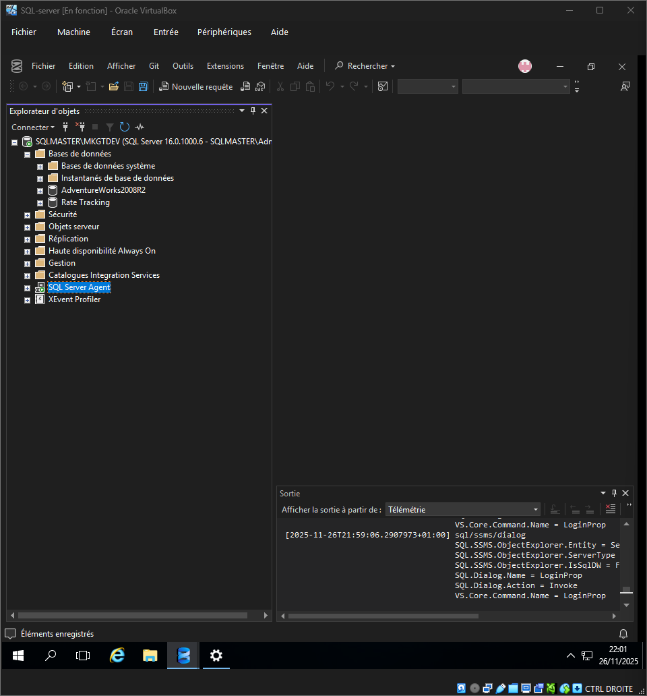
<p align="center"><i>Connexion à l'instance MKTGDEV via SQL Server Management Studio</i></p>

#### Organisation du stockage
```
D:\MKGTDEV\          → Fichiers de données (.mdf, .ndf)
L:\MKGTDEV\          → Fichiers journaux (.ldf)
U:\BKPMKGTDEV\       → Sauvegardes (.bak)
```

**Justification :** La séparation physique des fichiers de données et des journaux sur des disques distincts optimise les performances en réduisant les conflits d'I/O. Le disque U: dédié aux sauvegardes garantit une meilleure organisation et facilite les stratégies de backup.

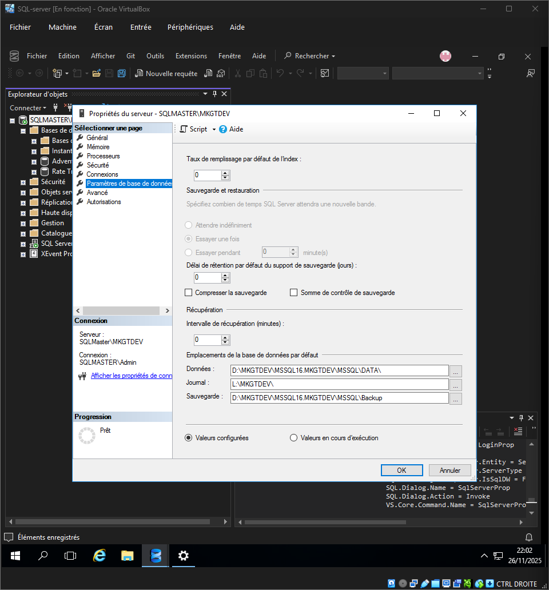
<p align="center"><i>Configuration des répertoires par défaut pour les données et journaux</i></p>

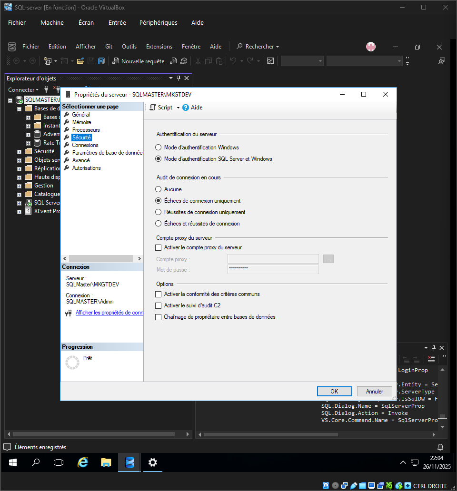
<p align="center"><i>Activation du mode d'authentification mixte (Windows + SQL Server)</i></p>

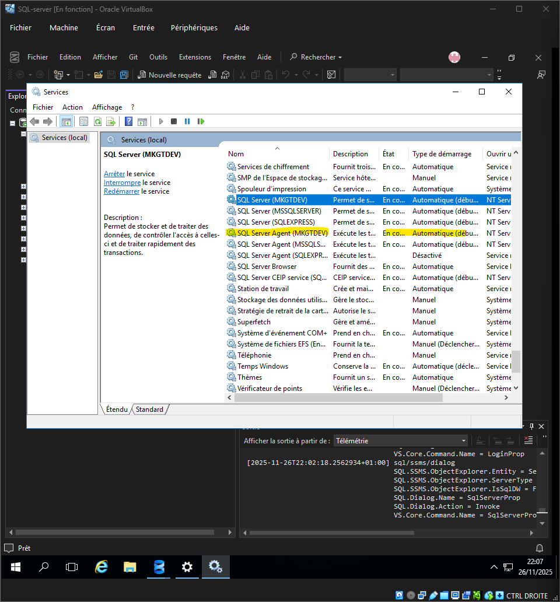
<p align="center"><i>Configuration des services SQL Server et Agent en démarrage automatique</i></p>


<p align="center"><i>Ajout d'un compte administrateur SQL Server</i></p>

### 2. Reconfiguration de tempdb

#### Configuration appliquée
- **Fichier principal (tempdev) :** 30 MB initial, croissance de 10 MB
- **Fichier journal (templog) :** 10 MB initial, croissance de 10 MB
- **Fichiers secondaires :** tempdev2 et tempdev3 (20 MB chacun)

**Bonnes pratiques appliquées :**
- Nombre de fichiers de données aligné sur le nombre de cœurs CPU disponibles
- Tous les fichiers de données ont des tailles identiques pour un meilleur équilibrage
- Placement des fichiers tempdb sur le disque D: (données) et L: (journaux)

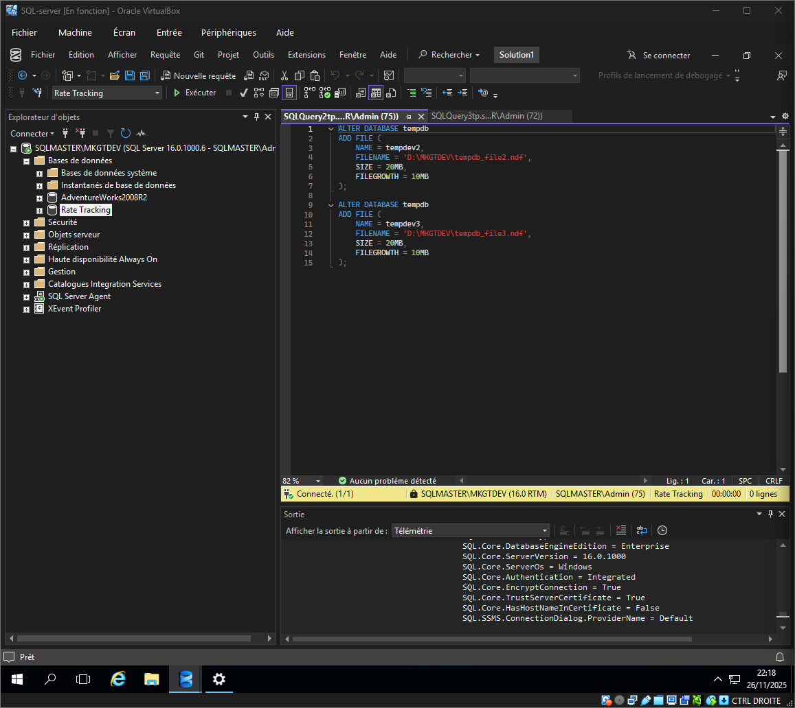
<p align="center"><i>Script ALTER DATABASE pour reconfigurer tempdb</i></p>

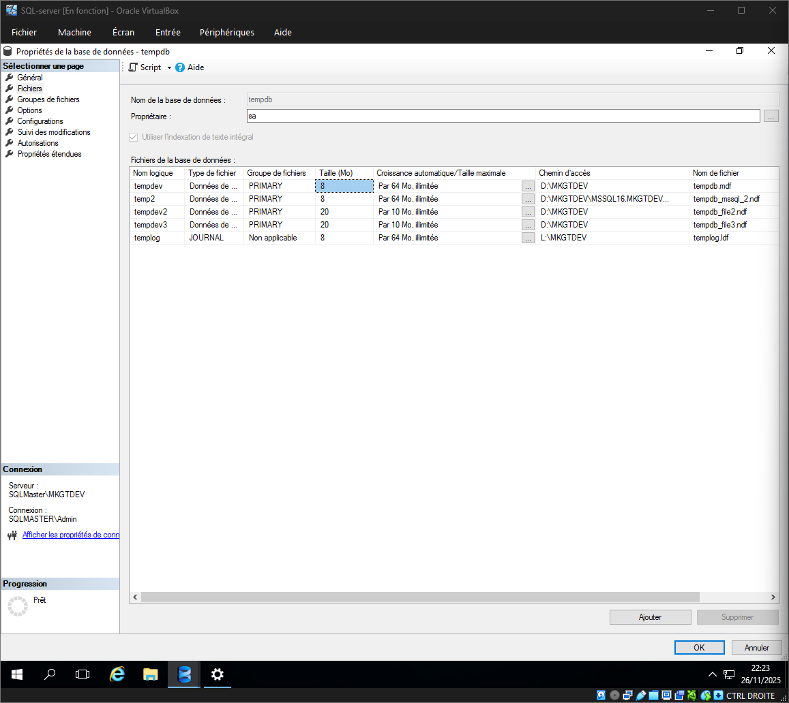
<p align="center"><i>Vue des fichiers tempdb avec les nouveaux paramètres</i></p>

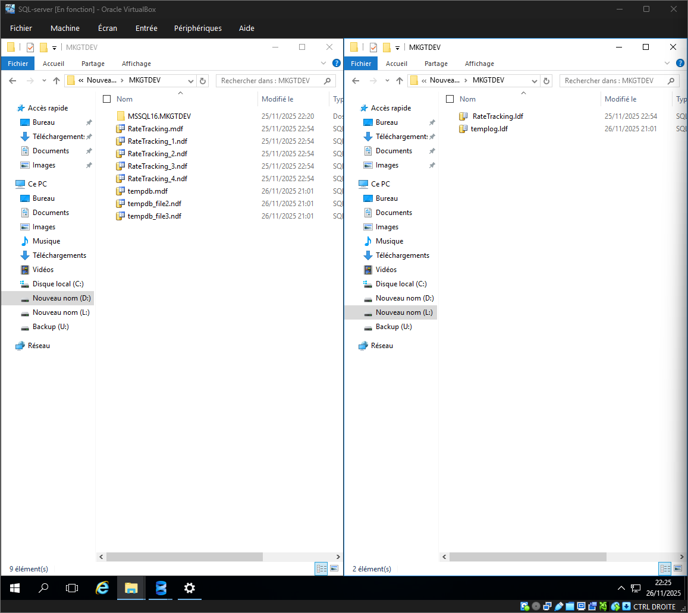
<p align="center"><i>Emplacement des fichiers tempdb sur les disques D: et L:</i></p>

---

## Configuration des bases de données

### 1. Base de données RateTracking

#### Architecture des fichiers

##### Fichier principal (PRIMARY)
```
Nom logique : RateTracking_dat
Nom physique : RateTracking.mdf
Emplacement : D:\MKGTDEV
Taille initiale : 10 MB
Croissance : 10 MB
Taille maximale : 100 MB
```

##### Fichier journal
```
Nom logique : RateTracking_log
Nom physique : RateTracking_log.ldf
Emplacement : L:\MKGTDEV
Taille initiale : 20 MB
Croissance : 20 MB
Taille maximale : Illimitée
```

#### Groupes de fichiers

##### Groupe USERDATA (par défaut)
Contient 3 fichiers de données :
- RateTracking_dat_1
- RateTracking_dat_2
- RateTracking_dat_3

**Configuration :**
- Emplacement : D:\MKGTDEV
- Taille initiale : 100 MB par fichier
- Croissance : 50 MB
- Taille maximale : 500 MB par fichier

**Utilisation :** Stockage des tables et index utilisateur en production.

##### Groupe ARCHIVE
Contient 1 fichier de données :
- RateTracking_dat_4

**Configuration :**
- Emplacement : D:\MKGTDEV
- Taille initiale : 200 MB
- Croissance : 100 MB
- Taille maximale : 1 GB

**Utilisation :** Stockage des données archivées ou historiques à faible fréquence d'accès.

#### Stratégie de stockage
Le groupe de fichiers **USERDATA** est défini comme groupe par défaut, ce qui signifie que tous les nouveaux objets (tables, index) seront automatiquement créés dans ce groupe, offrant ainsi une meilleure répartition de la charge sur plusieurs fichiers.

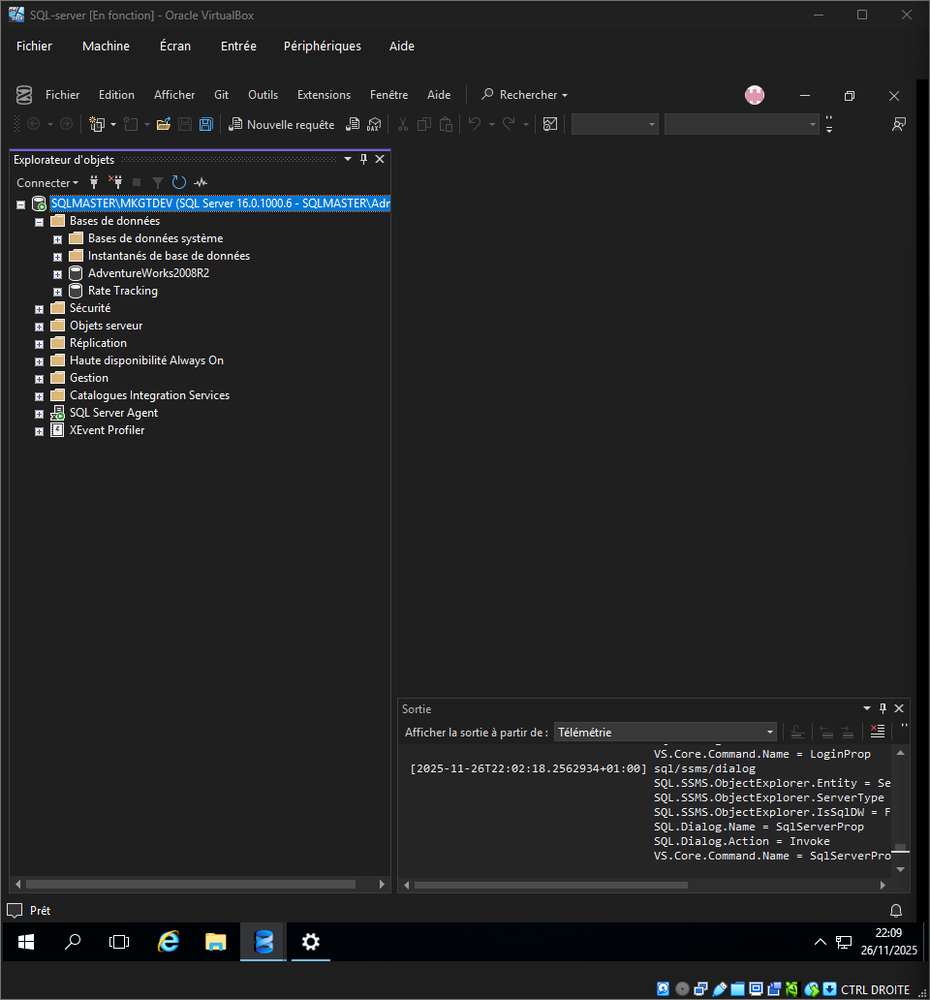
<p align="center"><i>Vue d'ensemble de la base RateTracking dans l'explorateur d'objets</i></p>

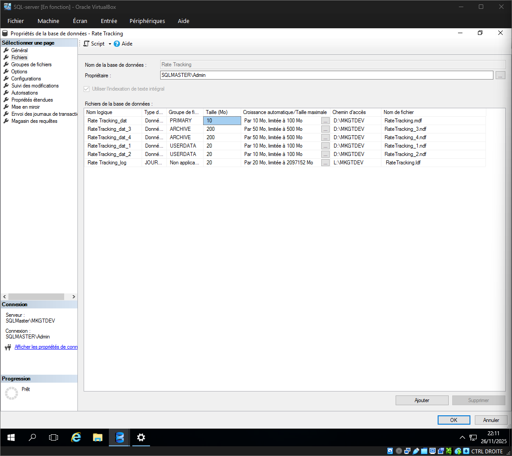
<p align="center"><i>Détail de la configuration des fichiers de données et journaux</i></p>

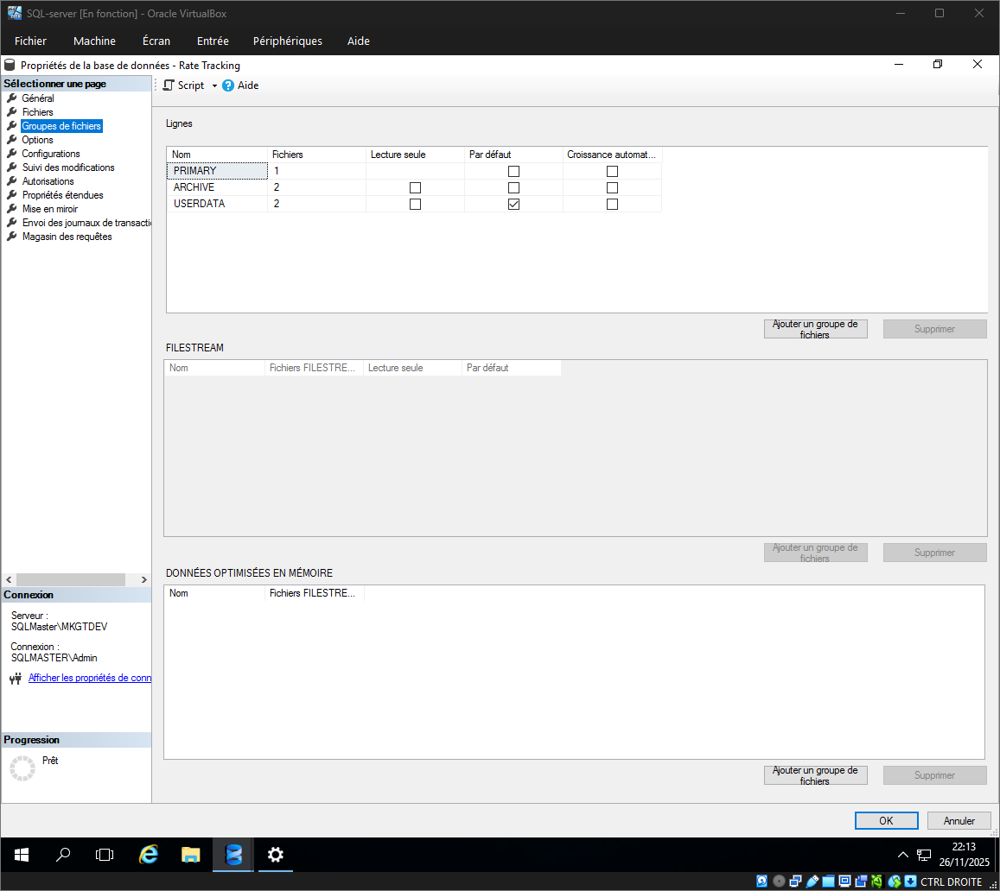
<p align="center"><i>Configuration du groupe de fichiers USERDATA comme groupe par défaut</i></p>

### 2. Base de données AdventureWorks

Base de données de démonstration Microsoft utilisée pour les tests de sauvegarde et restauration, ainsi que pour la configuration des accès utilisateurs.

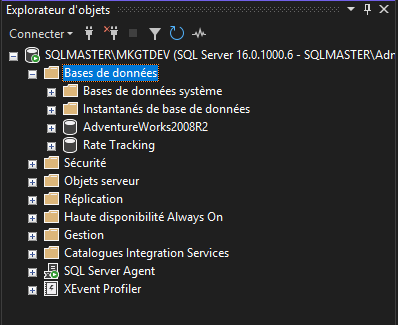
<p align="center"><i>Base de données AdventureWorks présente sur l'instance MKTGDEV</i></p>

---

## Stratégie de sauvegarde

### 1. Types de sauvegardes configurées

#### Sauvegarde complète
- **Fréquence :** Hebdomadaire (Dimanche à 03h00)
- **Type :** Full Backup
- **Compression :** Activée
- **Destination :** U:\BKPMKGTDEV
- **Objectif :** Point de récupération complet de la base

#### Sauvegardes différentielles/incrémentielles
- **Fréquence :**
  - Lundi à 05h00
  - Mercredi à 05h00
  - Vendredi à 19h00
- **Type :** Differential Backup
- **Compression :** Activée
- **Destination :** U:\BKPMKGTDEV
- **Objectif :** Capturer les modifications depuis la dernière sauvegarde complète

### 2. Comparatif compression vs non-compression

| Type de sauvegarde | Taille fichier | Temps d'exécution | Espace disque économisé |
|-------------------|----------------|-------------------|-------------------------|
| Non compressée | *Référence* | *Référence* | 0% |
| Compressée | ~40-60% plus petit | Légèrement plus long | 40-60% |

**Recommandation :** La compression est activée pour toutes les sauvegardes en production afin de réduire l'espace de stockage et le temps de transfert réseau.


<p align="center"><i>Configuration d'une sauvegarde complète sans compression</i></p>

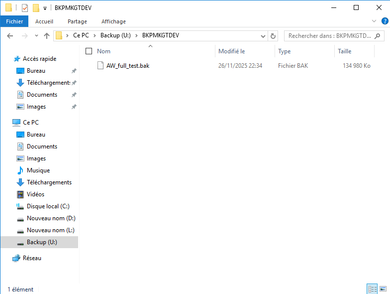
<p align="center"><i>Taille du fichier de sauvegarde non compressé</i></p>

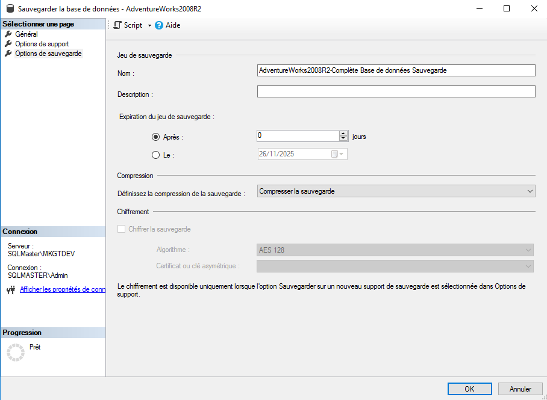
<p align="center"><i>Configuration d'une sauvegarde complète avec compression</i></p>

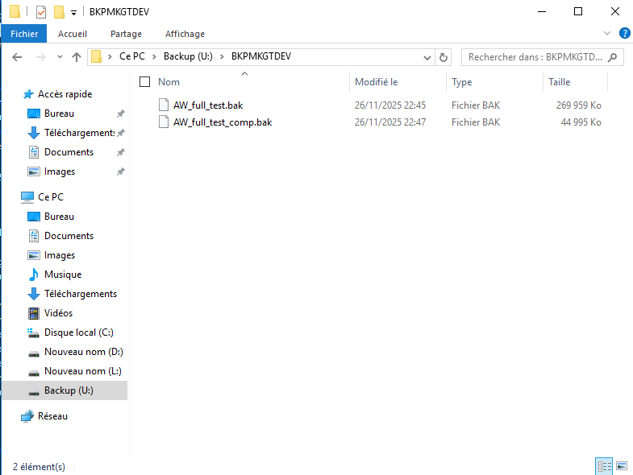
<p align="center"><i>Comparaison de la taille avec la compression activée</i></p>

### 3. Implémentation technique

#### Méthode 1 : Plan de maintenance
- Configuration via l'assistant SQL Server Maintenance Plan
- Interface graphique intuitive
- Gestion centralisée des tâches de maintenance
- Logging automatique

#### Méthode 2 : SQL Server Agent Jobs
- Jobs configurés manuellement pour plus de flexibilité
- Séparation des jobs :
  - Job "Sauvegarde Complète AdventureWorks"
  - Job "Sauvegardes Incrémentielles AdventureWorks"
- Possibilité d'ajouter des notifications par email
- Historique d'exécution détaillé

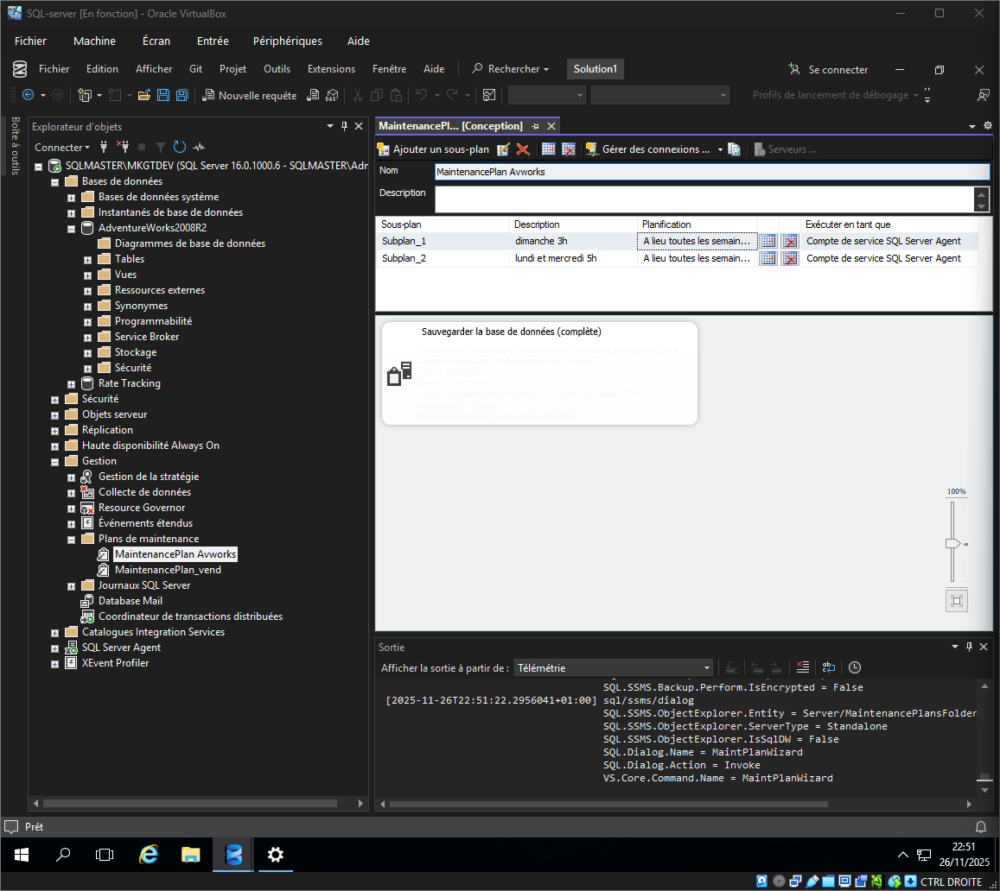
<p align="center"><i>Vue du plan de maintenance configuré pour AdventureWorks</i></p>

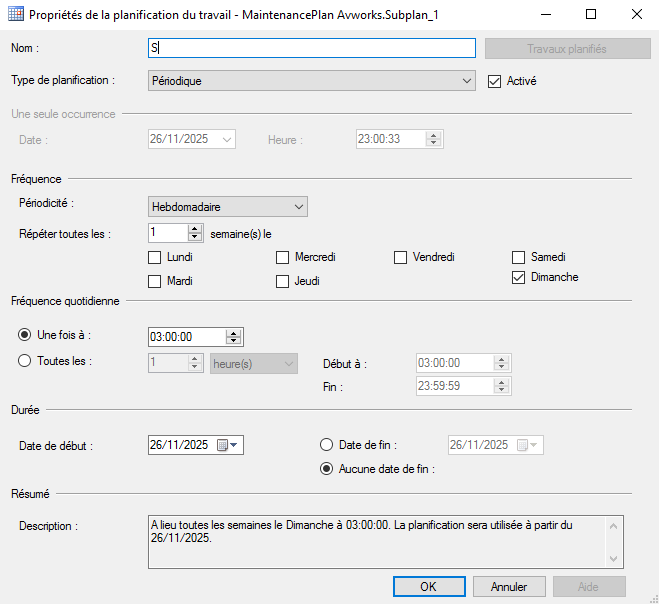
<p align="center"><i>Planification de la sauvegarde complète (Dimanche à 03h00)</i></p>

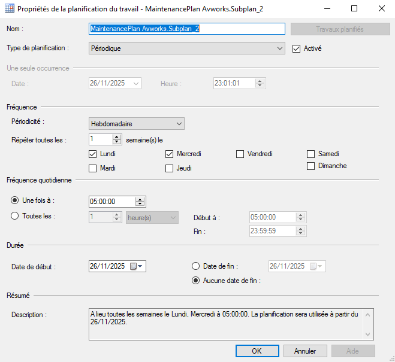
<p align="center"><i>Planification des sauvegardes incrémentielles (Lundi et Mercredi à 05h00)</i></p>

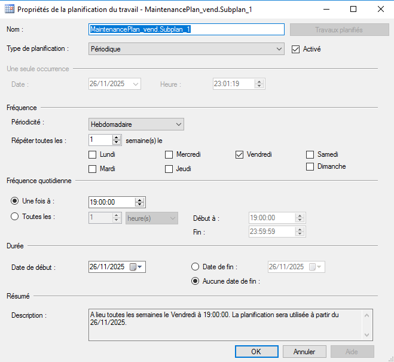
<p align="center"><i>Planification de la sauvegarde incrémentielles (Vendredi à 19h00)</i></p>

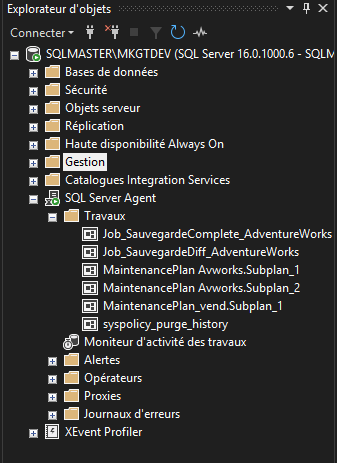
<p align="center"><i>Jobs SQL Server Agent configurés pour les sauvegardes automatisées</i></p>

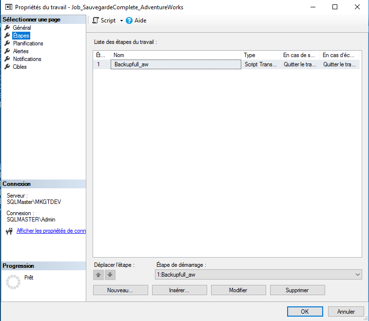
<p align="center"><i>Détail des étapes du job de sauvegarde complète</i></p>


<p align="center"><i>Configuration de la planification du job de sauvegarde</i></p>

### 4. Stratégie de rétention recommandée
- **Sauvegardes complètes :** Conservation de 4 semaines (1 mois)
- **Sauvegardes incrémentielles :** Conservation jusqu'à la prochaine sauvegarde complète
- **Sauvegardes archivées :** Conservation de 1 an pour conformité

---

## Gestion de la sécurité et des accès

### 1. Mode d'authentification

**Type configuré :** Authentification mixte (Mixed Mode)

**Avantages :**
- Support des comptes Windows (intégration Active Directory)
- Support des comptes SQL Server natifs
- Flexibilité pour applications tierces
- Compatibilité avec environnements hétérogènes

### 2. Utilisateurs configurés

#### Comptes SQL Server (authentification SQL)

##### Compte : consult
```
Type : Login SQL Server
Mot de passe : C0nsulT
Base : AdventureWorks
Rôle : db_datareader
Permissions : Lecture seule
```
**Cas d'usage :** Utilisateurs ou applications nécessitant un accès en consultation uniquement.

##### Compte : redact
```
Type : Login SQL Server
Mot de passe : REd@cT
Base : AdventureWorks
Rôle : db_owner
Permissions : Accès complet
```
**Cas d'usage :** Administrateurs fonctionnels ou applications nécessitant des droits d'écriture et de modification de structure.

#### Comptes Windows

##### Compte : User1
```
Type : Login Windows
Base : AdventureWorks
Rôle : db_datareader
Permissions : Lecture seule
```
**Cas d'usage :** Utilisateurs du domaine nécessitant un accès en consultation via authentification Windows.

##### Compte : User2
```
Type : Login Windows
Base : AdventureWorks
Rôle : db_owner
Permissions : Accès complet
```
**Cas d'usage :** Administrateurs du domaine nécessitant des droits complets.

### 3. Matrice des permissions

| Utilisateur | Type | Base | Lecture | Écriture | Modification structure | DDL |
|-------------|------|------|---------|----------|------------------------|-----|
| consult | SQL | AdventureWorks | ✓ | ✗ | ✗ | ✗ |
| redact | SQL | AdventureWorks | ✓ | ✓ | ✓ | ✓ |
| User1 | Windows | AdventureWorks | ✓ | ✗ | ✗ | ✗ |
| User2 | Windows | AdventureWorks | ✓ | ✓ | ✓ | ✓ |

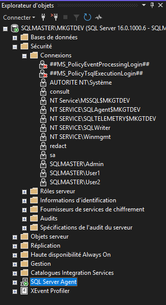
<p align="center"><i>Vue de tous les logins créés dans l'instance</i></p>


<p align="center"><i>Mappage et rôle db_datareader pour l'utilisateur consult</i></p>

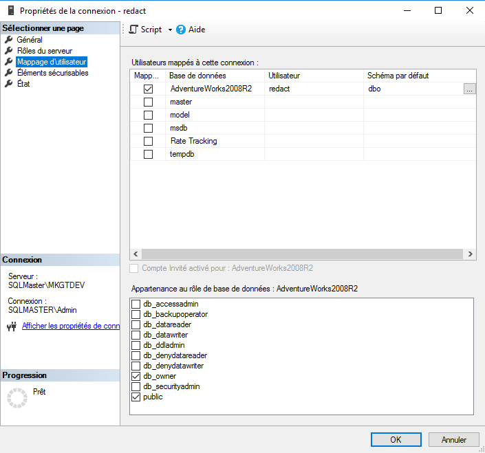
<p align="center"><i>Mappage et rôle db_owner pour l'utilisateur redact</i></p>

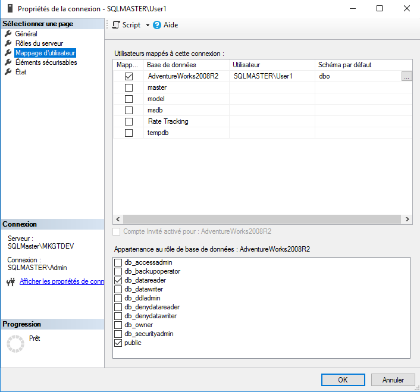
<p align="center"><i>Mappage et rôle db_datareader pour l'utilisateur Windows User1</i></p>

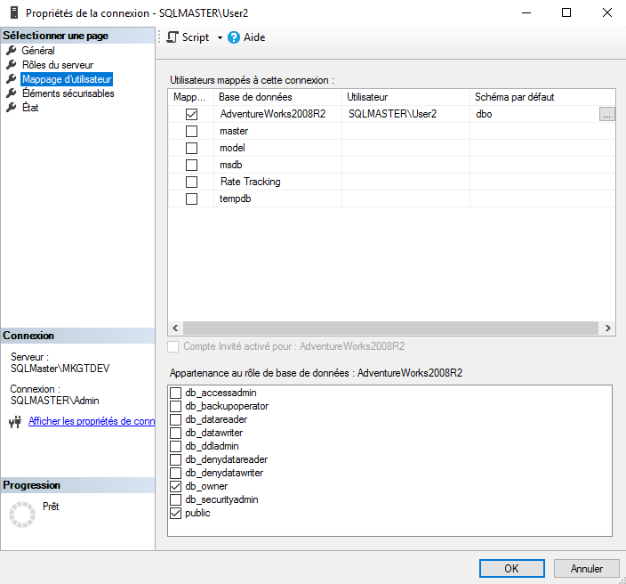
<p align="center"><i>Mappage et rôle db_owner pour l'utilisateur Windows User2</i></p>

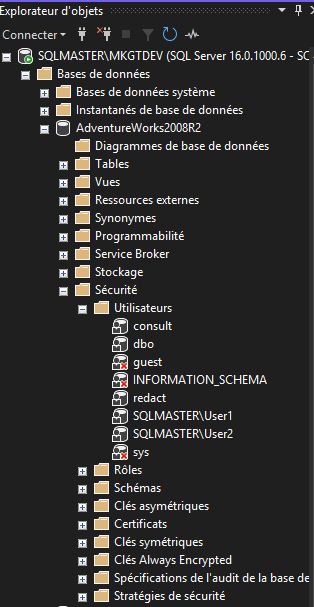
<p align="center"><i>Vue de tous les utilisateurs configurés dans la base AdventureWorks</i></p>

### 4. Bonnes pratiques de sécurité appliquées

1. **Principe du moindre privilège :** Chaque utilisateur dispose uniquement des permissions nécessaires à ses fonctions
2. **Séparation des responsabilités :** Distinction claire entre comptes en lecture seule et comptes administrateurs
3. **Authentification mixte :** Utilisation de l'authentification Windows quand possible pour bénéficier de la gestion centralisée
4. **Mots de passe complexes :** Respect des exigences de complexité pour les comptes SQL Server
5. **Mappage utilisateur :** Association explicite des logins aux utilisateurs de base de données

---

## Recommandations et bonnes pratiques

### 1. Performances

#### Fichiers de données
- ✓ Utiliser plusieurs fichiers de données dans le groupe USERDATA pour améliorer le parallélisme
- ✓ Définir des tailles initiales appropriées pour éviter la croissance automatique fréquente
- ✓ Utiliser une croissance en MB plutôt qu'en pourcentage pour une meilleure prévisibilité

#### tempdb
- ✓ Créer autant de fichiers de données que de cœurs CPU (max 8)
- ✓ Tous les fichiers doivent avoir la même taille initiale
- ✓ Placer tempdb sur un disque rapide et dédié si possible

### 2. Maintenance

#### Sauvegardes
- ✓ Tester régulièrement les restaurations (au moins une fois par mois)
- ✓ Vérifier l'intégrité des sauvegardes (RESTORE VERIFYONLY)
- ✓ Surveiller l'espace disque disponible pour les sauvegardes
- ✓ Automatiser les notifications d'échec de sauvegarde

#### Maintenance régulière
- ⚠ Planifier des tâches de :
  - Mise à jour des statistiques
  - Reconstruction/réorganisation des index
  - Vérification de l'intégrité (DBCC CHECKDB)
  - Nettoyage de l'historique et des logs

### 3. Surveillance

#### Éléments à surveiller
- Espace disque utilisé par les bases de données
- Taille des fichiers journaux
- Performances des requêtes
- Utilisation CPU et mémoire
- Blocages et deadlocks
- État des jobs SQL Server Agent
- Alertes système

### 4. Haute disponibilité

#### Options recommandées pour l'évolution
- **AlwaysOn Availability Groups :** Pour la haute disponibilité et la répartition de charge en lecture
- **Database Mirroring :** Solution de basculement automatique
- **Log Shipping :** Pour une solution de reprise après sinistre économique
- **Replication :** Pour la distribution de données vers plusieurs serveurs

### 5. Sécurité avancée

#### Améliorations possibles
- Activer le chiffrement TDE (Transparent Data Encryption) pour les données sensibles
- Implémenter Always Encrypted pour protéger les colonnes critiques
- Configurer l'audit SQL Server pour tracer les accès
- Mettre en place des politiques de rotation des mots de passe
- Restreindre l'accès réseau via le pare-feu SQL Server

---

## Annexes

### A. Scripts SQL utiles

#### Vérifier la configuration de tempdb
```sql
SELECT 
    name AS [Nom logique],
    physical_name AS [Emplacement physique],
    size * 8 / 1024 AS [Taille (MB)],
    max_size * 8 / 1024 AS [Taille max (MB)],
    growth * 8 / 1024 AS [Croissance (MB)]
FROM sys.master_files
WHERE database_id = DB_ID('tempdb');
```

#### Lister les groupes de fichiers et fichiers d'une base
```sql
USE RateTracking;
GO

SELECT 
    fg.name AS [Groupe de fichiers],
    fg.is_default AS [Défaut],
    f.name AS [Fichier logique],
    f.physical_name AS [Emplacement],
    f.size * 8 / 1024 AS [Taille (MB)]
FROM sys.filegroups fg
INNER JOIN sys.database_files f ON fg.data_space_id = f.data_space_id;
```

#### Vérifier les permissions utilisateurs
```sql
USE AdventureWorks;
GO

SELECT 
    dp.name AS [Utilisateur],
    dp.type_desc AS [Type],
    r.name AS [Rôle]
FROM sys.database_principals dp
LEFT JOIN sys.database_role_members drm ON dp.principal_id = drm.member_principal_id
LEFT JOIN sys.database_principals r ON drm.role_principal_id = r.principal_id
WHERE dp.type IN ('S', 'U')
ORDER BY dp.name;
```

### B. Checklist de validation

#### Installation de l'instance
- [ ] Instance MKTGDEV créée et accessible
- [ ] Mode d'authentification mixte activé
- [ ] Services SQL Server et Agent configurés en démarrage automatique
- [ ] Répertoires par défaut configurés sur D: et L:
- [ ] Administrateur SQL ajouté

#### Configuration des bases de données
- [ ] Base RateTracking créée avec tous les fichiers
- [ ] Groupe de fichiers USERDATA défini par défaut
- [ ] Base tempdb reconfigurée avec plusieurs fichiers
- [ ] Redémarrage effectué pour appliquer les changements tempdb
- [ ] Base AdventureWorks restaurée

#### Sauvegardes
- [ ] Tests de sauvegarde complète effectués
- [ ] Tests de sauvegarde compressée effectués
- [ ] Plan de maintenance créé et testé
- [ ] Jobs SQL Server Agent configurés
- [ ] Planifications validées
- [ ] Test de restauration effectué

#### Sécurité
- [ ] Logins SQL Server créés (consult, redact)
- [ ] Logins Windows créés (User1, User2)
- [ ] Mappages utilisateurs configurés
- [ ] Rôles de base de données assignés
- [ ] Tests de connexion effectués pour chaque compte

---

## Conclusion

Ce projet a permis de mettre en place une infrastructure SQL Server complète et conforme aux bonnes pratiques de l'industrie. L'architecture mise en œuvre offre :

- **Performance** : Séparation physique des données et journaux, configuration optimale de tempdb
- **Fiabilité** : Stratégie de sauvegarde automatisée et diversifiée
- **Sécurité** : Gestion granulaire des accès avec authentification mixte
- **Évolutivité** : Architecture flexible permettant l'ajout de fichiers et la croissance des bases

Cette configuration constitue une base solide pour un environnement de production et peut être étendue avec des fonctionnalités avancées selon les besoins futurs de l'organisation.

---

**Document généré le :** 27/11/2025  
**Version :** 1.0  
**Contact :** SANCHEZ Alexandre
